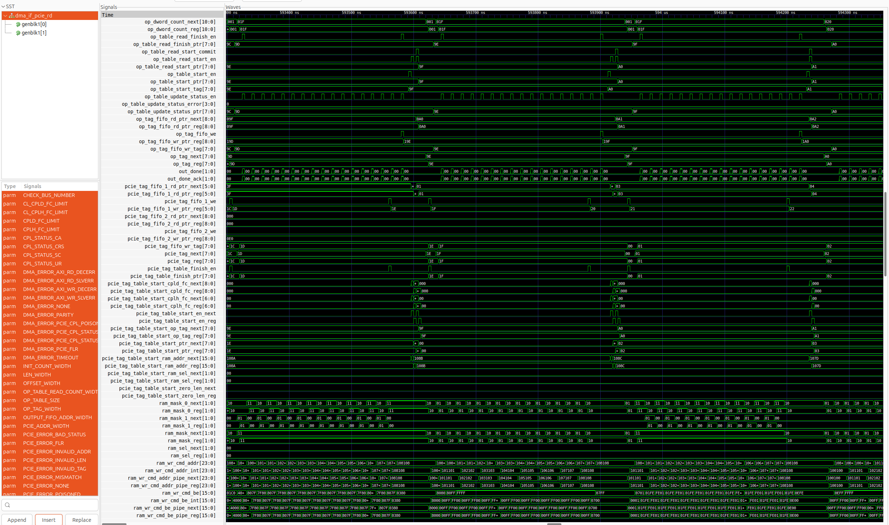
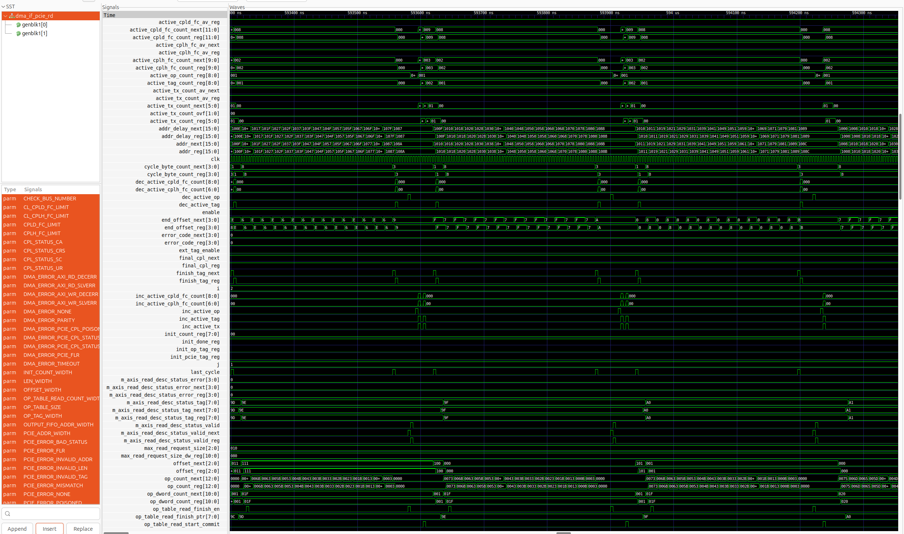
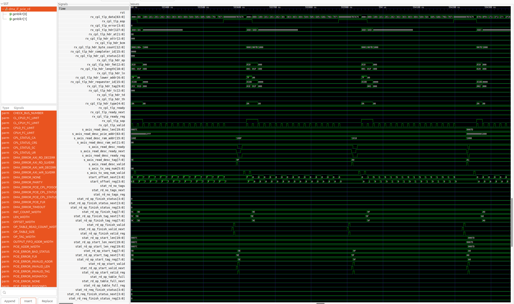

# RTL Latency Audit Method

**A completed DMA write is not proof the data landed.**

That gap between "the transaction finished" and "the bytes are where the next stage expects them" is where latency and correctness claims quietly fail. This repository is a short, public-safe writeup of the audit method I use to close that gap on real RTL, demonstrated on the PCIe Gen3 DMA read engine inside [Corundum](https://github.com/corundum/corundum), an excellent open-source high-performance FPGA NIC. It is a respectful methodology example on unmodified public source, not a takedown.

By John Bagshaw, ShawSilicon.

> **What tier this shows:** this demonstrates the audit *method* on third-party public RTL at the synthesis tier — out-of-context Fmax, exercised simulation, bound-and-fired assertions. A paid engagement goes deeper on your own design: post-route closure, per-stage latency budget, and a re-closure plan. That full depth, measured end to end, is the worked report at https://shawsilicon.ai/fpga-audit/sample-report.

## What the audit covers

A performance or latency claim about a PCIe/DMA design is cheap to assert and expensive to be wrong about, because the challenge usually arrives late: during a customer evaluation or after tapeout. The audit replaces an assertable claim with a defensible one. Concretely, an audit produces:

- **Synthesis.** Out-of-context (OOC) single-module synthesis of the RTL under audit, with real timing and utilization reports, not estimates.
- **Dynamic simulation.** The engine exercised end to end against a testbench, with a waveform dump that shows the request, completion, and RAM-write handshakes actually firing.
- **Assertions bound and executed.** Properties written against the design, bound into the simulation, and run, so a "pass" means the property was checked while the relevant logic was exercised, not merely compiled.
- **Every finding tied to a file and line.** Each statement traces to evidence in the public source. Where something cannot be measured, the audit says so plainly rather than estimating.

## Two insights this method is built to catch

These are the two failure patterns that the "a completed write is not proof the data landed" discipline exists to surface:

1. **A posted write being accepted is not the same as it being delivered.** On a posted (non-acknowledged) write path, the producer sees the transaction accepted and moves on. Acceptance by the fabric says nothing about the data having reached, and been committed at, the destination. A latency or throughput claim that measures to acceptance, not to delivery, is measuring the wrong edge.

2. **The green-but-unexercised vacuous pass.** An assertion that is bound but never triggered reports "pass" and contributes nothing. The logic it guards was never put in the state the property describes, so the green result is false confidence. An audit that does not check whether each assertion actually fired cannot distinguish a real pass from a vacuous one.

## Evidence: a real, exercised audit

The design audited here is the Corundum PCIe Gen3 DMA read engine, `dma_if_pcie_rd`. The numbers and waveforms below are the genuine output of tools run on this machine against unmodified public source. Nothing was drawn or hand-edited.

### Synthesis (recorded results)

Out-of-context single-module synthesis of `dma_if_pcie_rd`:

- Clock: 250 MHz / 4.000 ns PCIe user (axistream) clock
- Part: xczu7ev-ffvc1156-2-e (ZCU106)
- Datapath: 128-bit; PCIe Gen3 x4, ~32 Gb/s
- Internal register-to-register Fmax: ~332.8 MHz (332.78 MHz reproduced this run)
- WNS: +0.995 ns, TNS: 0.000 ns, 0 failing endpoints
- Utilization: 1891 CLB LUTs, 1213 FF, 0 BRAM

This is out-of-context single-module synthesis, not a board-level implemented closure. The headline number is the internal Fmax. No place-and-route, no bitstream, and no system block design were produced or claimed.

### Simulation (passing run)

The exact audited read engine was exercised against its cocotb testbench. Result, verbatim:

```
TESTS=4 PASS=4 FAIL=0 SKIP=0
  run_test_read_001          PASS
  run_test_read_002          PASS
  run_test_read_errors_001   PASS
  run_test_read_errors_002   PASS
```

### Waveforms

These are GTKWave captures from that passing run. They are evidence that the engine was driven end to end and observed at the signal level, not evidence of a defect.



*The read-request side: descriptor intake and PCIe tag allocation as outstanding read requests are issued. This is the front of the datapath, where requests enter the engine.*



*The full datapath in one view: read-request issue, PCIe completion arrival, and the RAM-write commands that land the returned data, with the engine's tag and state tracking active. This is the end-to-end path the "did the data actually land" question is about.*



*The back of the datapath: PCIe completions arriving, the RAM-write command handshakes that commit the data, and the read-descriptor status signalling the operation done. This is the delivery edge, the one that a posted-acceptance measurement would have skipped.*

## About and how to engage

ShawSilicon performs audit-grade FPGA/ASIC RTL latency and correctness reviews: each claim a design must support is tied to real synthesis, simulation, and executed-assertion evidence, and delivered in a fixed written format a client can forward without translation. The failure classes the method examines (clock-domain crossing, transaction ordering, credit and backpressure, reset and link-recovery sequencing, completion-path races, corner-timing margin) are generation-independent, so the same discipline scales from this Gen3 example to Gen5 and CXL design review, where the margins are thinnest.

- Audit overview: https://shawsilicon.ai/fpga-audit
- Contact: John Bagshaw, https://www.linkedin.com/in/jotshaw/

## Attribution and license

The design reviewed is **Corundum** (https://github.com/corundum/corundum), an open-source high-performance FPGA NIC and in-network-compute platform created by **Alex Forencich** and contributors. It is excellent work, and this demonstration is a respectful peer review that credits it. The audit reviews the public code and does not redistribute it; any reuse of Corundum's source is governed by its own licenses (repository root BSD-2-Clause; the PCIe RTL library files carry MIT headers, Copyright Alex Forencich). The simulation tooling used includes **cocotbext-pcie** (https://github.com/alexforencich/cocotbext-pcie), also by Alex Forencich, MIT licensed.

The writeup and method in this repository are my own work, MIT licensed. See [LICENSE](LICENSE) and [NOTICE](NOTICE).
